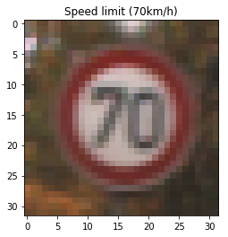
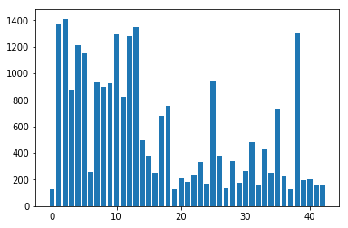
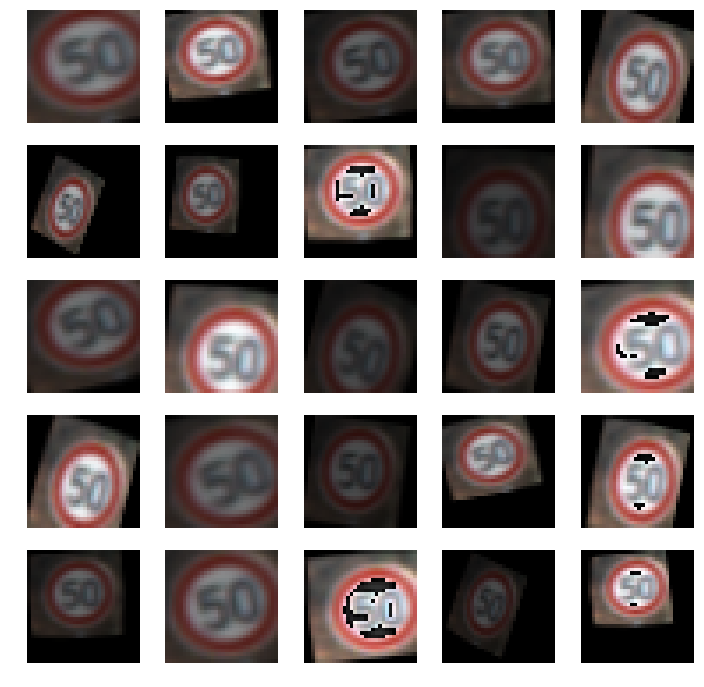
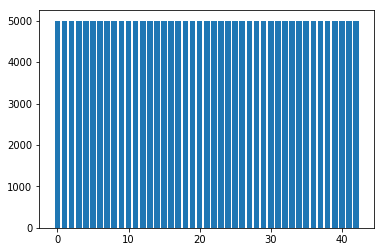
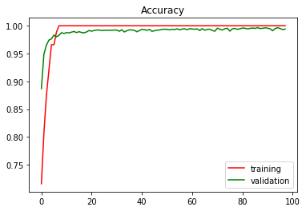
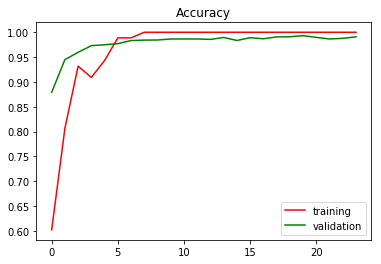
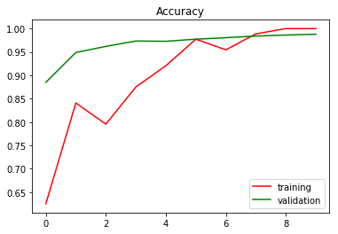

# Traffic Sign Recognition


**Build a Traffic Sign Recognition Program**

The goals / steps of this project are the following:

* Load the data set ([German Traffic Sign Dataset](https://d17h27t6h515a5.cloudfront.net/topher/2017/February/5898cd6f_traffic-signs-data/traffic-signs-data.zip))
* Explore, summarize and visualize the data set
* Design, train and test a model architecture
* Use the model to make predictions on new images
* Analyze the softmax probabilities of the new images
* Summarize the results with a written report


### Data Set Summary & Exploration

#### 1. Provide a basic summary of the data set. In the code, the analysis should be done using python, numpy and/or pandas methods rather than hardcoding results manually.

Since the German Traffic Sign Dataset was already provided in pickle format. It was easier to load the given data using Python's Standard Library `pickle`. (Notebook cell # 2) SciKit Learn `module_selection` was used to split the input data in training and test samples, 30% of the given data was reserved for testing puposes. Below is a summay of the 

> Number of training examples = 24359
> 
> Number of testing examples = 12630
> 
> Number of validation examples = 10440
> 
> Image data shape = (32, 32, 3)
> 
> Number of classes = 43

The images in dataset is of the shape `32×32×3` which is the prefered dimension for further processing.

#### 2. Include an exploratory visualization of the dataset.

Cell # 4 in the notebook shows validation for random images from the dataset and the corresponding labels.



It's very common to have different numbers of input samples for every label in any data collection process. However having varied number of samples per decision point will negatively impact the Neural Network and the network may tend to prefer decisions more based the label which had more number of samples in the dataset. The below histogram give an illustration of how the number of samples varies per `43` different labels.




### Design and Test a Model Architecture

#### 1. Describe how you preprocessed the image data. What techniques were chosen and why did you choose these techniques? Consider including images showing the output of each preprocessing technique. Pre-processing refers to techniques such as converting to grayscale, normalization, etc. 


Dataset augmentation is very essential to improve performance of the Perceptron (Classification step) in a neural network. Apparently data augmentation in data-space is much performant that augmentation in feature-space [1].

```
REFERENCE
1) Understanding data augmentation for classification: when to warp?. Site: https://arxiv.org/pdf/1609.08764.pdf
```

Jupyter Notebook - Cell # 6 - implements the following preprocessing techniques on the input images, such as, `Rotation, Translation, Shear, Brightness Adjustments`. The below images shows various types of image augmentation applied on the input samples.




Cell # 8 makes use of these methods to increase the number of sample for each label and normalizes it to **5000** images for every label. Therefore the trained model will not be biased to any of the dominating labels. Below is the histogram, showing distribution, of number of sample size for every sample labels




#### 2. Describe what your final model architecture looks like including model type, layers, layer sizes, connectivity, etc.) Consider including a diagram and/or table describing the final model.

My model consists of the layers listed below. Added a dropout & ReLU (for non-linearity) for almost every convolutional layer and the fully connected layers)


| Layer         		|     Description	        						| 
|:---------------------:|:---------------------------------------------:|
| Input         		| 32x32x3 RGB image
| Conv2D				| 1x1 stride, valid padding, outputs 28x28x32
| RELU					| ===
| Max Pooling			| 2x2 stride, valid padding, outputs 14x14x32
| Dropout				| 0.5
| Conv2D   			| 1x1 stride, valid padding, outputs 10x10x64
| RELU					| ===
| Max Pooling			| 2x2 stride, valid padding, outputs 5x5x64
| Dropout				| 0.5
| Flatten				| with input from both max-pool layers, outputs 7872
| RELU					| ===
| Dropout				| 0.5
| Fully Connected	| input 1024, output 1024
| RELU					| ===
| Dropout				| 0.5
| Fully Connected	| input 1024, output 43
| Dropout				| 0.5
 
### a) Dropouts 

Dropouts are good at improving/providing generalization to the model by randomly nullifying and it forcing the network to relearn. Added dropouts to almost every layer in the model, which seems to marginally improve performance.

### b) L2 Regularization

Besides Droupouts, Regularization is also a very important technique to avoid overfitting the model. L2 regularization provides unique stable solutions over L1 regularitzation. It is also computationally efficient and alway provides one concrete & stable solution. With basic trial and error, choosen an arbitrary value of **0.00001** as lambda, which seems to work fine. 

From Cell # 16

```
rate = 1e-4  ## 1e-3
lamda = 1e-5 ## 1e-4
```
```
logits = LeNet(x)
cross_entropy = tf.nn.softmax_cross_entropy_with_logits(logits, one_hot_y)
```

```
## L2 regularization for weights
l2_loss = lamda * (tf.nn.l2_loss(conv1_W) + tf.nn.l2_loss(conv2_W) + tf.nn.l2_loss(fc1_W) + tf.nn.l2_loss(fc2_W) + tf.nn.l2_loss(fc3_W))
loss_operation = tf.reduce_mean(cross_entropy + l2_loss)
```

### c) Early Stopping

Using early stopping mechanism to look for cross entropy loss across the training epochs and stop training once the validation accuracy stops improving.

```
        # early stop if accuracy does not improve in #n epochs
        if non_improve_counter > 5:
            print("Early stop at epoch {}".format(i))
            break
```

#### 3. Describe how you trained your model. The discussion can include the type of optimizer, the batch size, number of epochs and any hyperparameters such as learning rate.

The defined model is trained using AdamOptimizer in using a random learning rate of **0.0001** and the goal of the optimizer was to minimize the loss function based on L2 Regularization discussed above.

| S.No.	| Lamda	| Learning Rate	| Epoch	| Batch Size	| Training Epoch | Test Accuracy
|:------|-----|-----|-----|-----|-----|-----|
| 1			| 1e-5		| 1e-4	| 10	|	128	|	10	|	0.927
| 2			| 1e-4		| 1e-4	| 100	|	128	|	23	|	0.941
| 3			| 1e-5		| 1e-4	| 100	|	128	|	97	|	0.953


#### 4. Describe the approach taken for finding a solution and getting the validation set accuracy to be at least 0.93. Include in the discussion the results on the training, validation and test sets and where in the code these were calculated. Your approach may have been an iterative process, in which case, outline the steps you took to get to the final solution and why you chose those steps. Perhaps your solution involved an already well known implementation or architecture. In this case, discuss why you think the architecture is suitable for the current problem.

My final model results were:

* Training set accuracy : 1.0
* Validation set accuracy : 0.994
* Test set accuracy : 0.953

The model chosen for this task was a proven architecture for general classification tasks. The original LeNet Architecture was implemented to get it all working. Then additional layers `ReLUs` were added to improve regularization and `Dropout` layers to reduce overfitting. Several training attempts were made with different preprocessing pipelines. Once the preprocessing was stabilized, other parameters like learning rate, number of epochs, batch-size were fine tuned.

Higher learning rates & epochs less than 10 didn't seem to provide the exepcted results. Lower learning rates with longer epoch cycles seemed to improve the model better and deifinitely the early stopping turned out to be a key factor in avoiding model overfitting.  
 

### Testing the Model

The model was tested against the given test data and the training and validation accuracies are ploted, shown below.

* Epoch - 97
	* Test Accuracy - 0.953
	* [Training Log](./epoch97-training-log.txt)



* Epoch - 23
	* Test Accuracy - 0.941
	* [Training Log](./epoch23-training-log.txt)




* Epoch - 10
	* Test Accuracy - 0.927
	* [Training Log](./epoch10-training-log.txt)




